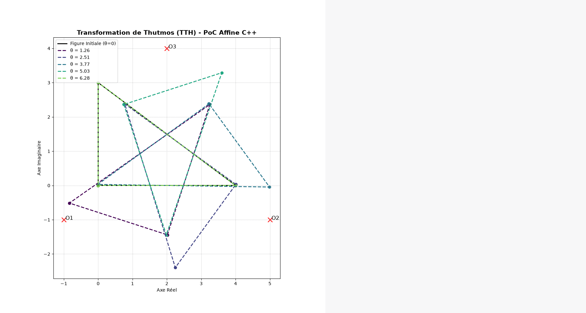

# OpenTTH Foundation 🏛️

**OpenTTH** is the official software ecosystem of the **Thutmos Transformation (TTH)**. This mathematical and computational framework introduces a new transformational paradigm based on a multi-centric deformation process, replacing classical global mappings in geometry.

## 📖 About the TTH Theory

TTH unifies Euclidean geometry, systems dynamics, and discrete harmonic analysis. By introducing spatial weighting functions, the transformation loses its linearity to locally induce a non-trivial Riemannian metric.

This monorepo contains the 9 fundamental libraries allowing the exploration and application of the theory, ranging from pure tensor calculus to Artificial Intelligence.

## 🏗️ Monorepo Architecture

### 🧮 Pure Mathematics & Geometry (C++ Back-ends)

* **`libtth-core`**: Fundamental engine handling affine operations and complex isomorphism.
* **`libtth-diff`**: Differential engine for the computation of the non-linear Jacobian tensor $J_T(x)$.
* **`libtth-lie`**: Algebraic engine calculating the commutators $[T_1, T_2]$ (Lie brackets).

### 🌌 Riemannian Geometry & Topology (Python)

* **`tth-riemann`**: Evaluation of the induced metric $g_{ij}$ and mapping of the spatial curvature.
* **`tth-topology`**: Modeling of the three-dimensional spatial bundle and deformation on $SO(3)$.

### 🎶 Spectral & Harmonic Analysis

* **`tth-spectra`**: Analysis of Banach attractors and ergodic dynamics.
* **`tth-fouriergeom`**: Geometric isomorphism and Discrete Fourier Transform (DFT).

### 🧠 Artificial Intelligence & Optimization

* **`tth-neural`**: PyTorch implementation of TTH as a geometric neural layer.
* **`libtth-optim`**: Resolution of non-linear geometric systems via SciPy.

## 🚀 Global Installation

Each C++ submodule must be compiled with `CMake` and `pybind11` to generate shared libraries (`.so`).
The Python scripts require standard dependencies: `numpy`, `matplotlib`, `scipy`, `scikit-learn`, and `torch`.

---

**Author:** Salvador-Jose Mountanta Famorosa

[Contact me](mailto:vieirasalva@gmail.com)

**License:** Apache 2.0

  

